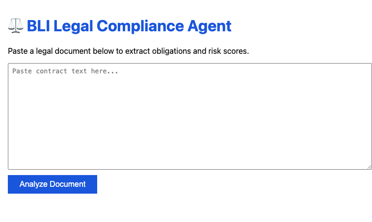
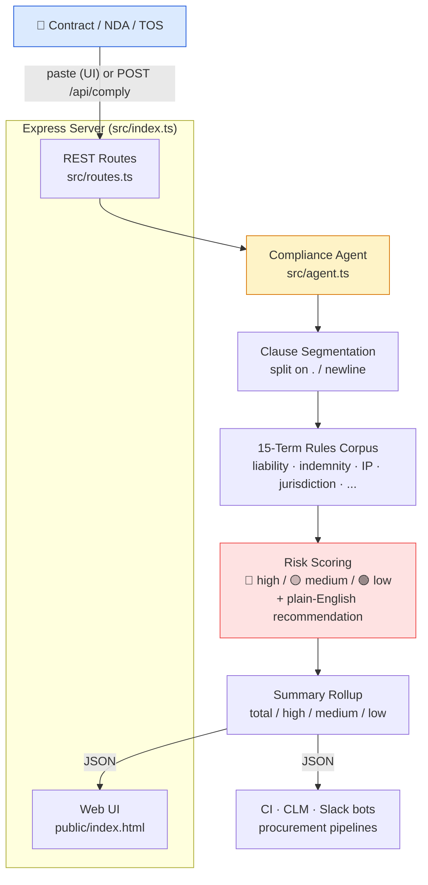

# ⚖️ BLI Legal Compliance Agent

      

## 📸 Screenshot



**BLI Legal Compliance Agent** is an AI-powered legal document scanner that analyzes contracts, NDAs, and terms of service to extract obligations across 15 legal term categories and score each clause by risk (high / medium / low) with plain-English recommendations. It is fully deterministic, runs entirely on your own infrastructure with zero per-token cost, and exposes both a paste-and-analyze web UI and a REST API — so no document ever leaves your machine.

Built for the **BLI Legal Tech 2 Hackathon** ($50K · DoraHacks). Open source under MIT.

## ✨ Features
- **Obligation extraction** — keyword-based scanning across 15 legal term categories (liability, indemnification, IP, jurisdiction, …)
- **Risk scoring** — high / medium / low classification with actionable recommendations
- **REST API** — `POST /api/comply` for programmatic access
- **Web UI** — paste-and-analyze interface

## 🚀 Quick Start

**Docker (recommended — one command, no setup):**
```bash
docker compose up --build
```

**Or local Node.js:**
```bash
npm install
npm run build && npm start     # or: npm run dev for live reload
```

Then open **http://localhost:3000**, paste a contract, NDA, or terms of service into the box, and click **Analyze Document**. See risk-scored obligations in seconds.

> The repo ships a realistic **sample Mutual NDA** (see `DEMO_VIDEO_SCRIPT.md`) covering confidentiality, liability, indemnity, IP, and a Delaware governing-law clause — paste it to see the engine light up immediately.

## 🧱 Tech Stack
- **Runtime:** Node.js ≥ 18, TypeScript, Express
- **UI:** static HTML/JS paste interface
- **Container:** Docker / docker-compose

## 🔌 API
Health check:
```bash
curl http://localhost:3000/api/health
# {"status":"ok"}
```
Analyze a document:
```bash
curl -X POST http://localhost:3000/api/comply \
  -H "Content-Type: application/json" \
  -d '{"document":"The supplier shall indemnify the buyer against any liability..."}'
```
Sample response:
```json
{
  "obligations": [
    {
      "category": "Indemnity",
      "risk": "high",
      "recommendation": "Ensure mutual indemnification",
      "snippet": "...The supplier shall indemnify the buyer against any liability..."
    },
    {
      "category": "Liability",
      "risk": "high",
      "recommendation": "Negotiate cap on liability",
      "snippet": "...against any liability..."
    }
  ],
  "summary": { "total": 2, "high": 2, "medium": 0, "low": 0 }
}
```

## 🏗️ Architecture



**Component map:**
- **Agent** (`src/agent.ts`) — keyword-based obligation extraction with 15 legal term categories; `complianceAgent(doc)` is a **pure, deterministic, typed** function
- **Risk Scoring** — high / medium / low classification with category-specific recommendations
- **REST API** (`src/routes.ts`) — `POST /api/comply`, `GET /api/health`
- **Web UI** (`public/index.html`) — paste-and-analyze interface with color-coded risk badges

> **Why keyword-based over an LLM?** Determinism, privacy, and zero marginal cost. Every run on the same contract returns identical results, sensitive documents never leave your infrastructure, and there are no per-token fees or API keys to manage.

## 📋 Demo
1. Start: `docker compose up`
2. Open http://localhost:3000
3. Paste any legal document (contract, terms of service, NDA)
4. Click **Analyze Document** — see obligations with risk scores

## 📄 License
MIT — see [LICENSE](./LICENSE).

## 🤖 AI Assistants

→ See [CLAUDE.md](./CLAUDE.md) for AI coding assistant context.
